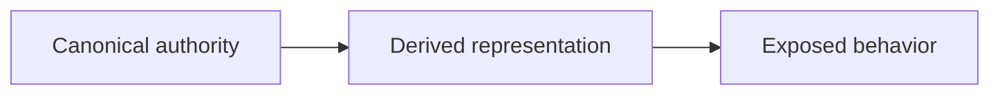

# Repository Anti-Drift Audit Report Presentation Guidance

Use this reference to present a full Markdown audit result in the normal response.

[`../SKILL.md`](../SKILL.md) is the canonical executable contract. It governs invocation, path validation, audit responsibility, finding classes, provenance, coverage, safety, and closure semantics. This reference controls presentation only.

The audit result is an observation of repository state at audit time. It does not become repository authority or a canonical semantic owner.

## Human-first presentation

Machine-stable IDs, classifications, provenance values, and coverage labels remain available, but human-facing reports should not require readers to memorize Repository Anti-Drift vocabulary. Put the human explanation first and the stable machine value second:

```text
Confirmed drift (CURRENT_DRIFT)
```

Use backticks around stable values in normal Markdown. For dense configuration or aggregate metadata, a separate secondary line is acceptable after the human-readable content.

Use this title:

```text
# Repository Anti-Drift Audit Report
```

## Summary

Lead with a compact human-readable orientation:

- target repository or scoped surface;
- AUDIT capability;
- audit time when available;
- human-readable counts by finding class;
- one short evidence-backed conclusion.

For example:

```text
Audit result

- 3 confirmed drift findings
- 2 areas where policy exists but deterministic enforcement is missing
- 2 areas that require authority, intent, or compatibility confirmation before change
- 2 areas where deterministic enforcement covers the stated audit scope

Internal classification:
CURRENT_DRIFT=3 / POLICY_ONLY=2 / COMPATIBILITY_RISK=2 / ALREADY_ENFORCED=2
```

The human summary comes first. The internal classification line is optional.

Use an early **Important limitation** callout only when a limitation could materially change finding classification, ownership interpretation, denominator confidence, or safe use of the findings. Examples include a large uncommitted migration, targeted or incomplete coverage affecting headline results, unavailable authority or compatibility evidence, concurrent changes affecting non-mutation attribution, or missing evidence that makes several material findings provisional. State only the consequence and the audit's restraint in the early callout; keep full counts, paths, and details in **Audit limitations**. Do not create a limitation severity enum.

## Audit configuration

Show applicable inputs and canonical provenance/coverage labels from `SKILL.md`:

```text
Canonical owners:
  <provenance labels and paths>

Comparison targets:
  <provenance labels and paths>

Search boundary:
  <scope or repository root>

Coverage:
  <TARGETED or SYSTEMATIC_SEARCH_WITHIN_SCOPE>
```

For targeted coverage, state that unsearched surfaces were not evaluated and are not claimed drift-free.

For systematic discovery, render the sequential response-local pass records, candidate census, and semantic coverage ledger required by `SKILL.md` in compact human-readable sections. This reference does not define the passes, their order, dispositions, candidate-preservation obligations, completeness rules, or coverage semantics; obtain those from `SKILL.md`.

For example:

```markdown
## Audit coverage

### Sequential pass records

#### <pass identifier and plain-language lens>

- Surfaces examined: <repository surfaces>
- Discovery methods: <methods>
- Candidate population / denominator: <population, denominator, or why unavailable>
- Discovered material candidates: <candidate census identifiers or “None found”>
- Dispositions: <plain-language dispositions>
- Material limitations: <limitations or “None identified”>

### Candidate census

| Candidate | Discovered in | Final disposition | Finding or traceability |
|---|---|---|---|
| <response-local identifier and condition> | <pass> | <finding, evidence-backed non-finding, unresolved, merged, or superseded> | <finding reference, evidence, or merge/supersession target> |
```

Present the five pass records in execution order and show a result for each before synthesis. The records must make it possible to distinguish a reported finding, examination with no candidate found, inapplicability supported by evidence, an inconclusive examination, and a pass that was blocked or not adequately inspected. The census must make every discovered material candidate traceable to its final disposition. Equivalent prose is acceptable. Put the human explanation first; stable machine labels may appear secondarily where useful. Do not create a separate presentation enum registry.

Keep material coverage limitations visible in both the ledger and the applicable summary or limitation section. When required systematic coverage is incomplete, describe that qualification alongside `SYSTEMATIC_SEARCH_WITHIN_SCOPE`; do not let the stable label visually imply complete or drift-free coverage. The ledger remains part of the response only and is not a report file or persistent audit-history artifact.

Recommended human renderings are:

- Systematic search within the requested repository scope (`SYSTEMATIC_SEARCH_WITHIN_SCOPE`)
- Targeted comparison only (`TARGETED`)
- Discovered automatically by the audit (`AUTO_DISCOVERED`)
- Supplied explicitly by the user (`USER_SPECIFIED`)
- User-supplied canonical candidate; authority not yet certified (`USER_SPECIFIED_CANONICAL`)
- No canonical owner has been confirmed yet (`CANONICAL_NOT_YET_CONFIRMED`)
- Authority or intent remains unresolved; the audit did not infer an answer (`DO NOT GUESS`)

Retain `NOT RUN` when applicable, but always explain why the operation was not run.

## Finding classes

Use the canonical classes without changing their meaning. These labels are presentation guidance, not replacement methodology definitions:

- Confirmed drift (`CURRENT_DRIFT`)
- Policy exists, but deterministic enforcement is missing (`POLICY_ONLY`)
- Cannot safely decide yet — authority, intent, or compatibility must be confirmed (`COMPATIBILITY_RISK`)
- Existing deterministic enforcement covers the stated audit scope (`ALREADY_ENFORCED`)

Do not describe `ALREADY_ENFORCED` as universal protection; its claim is limited to the stated denominator and demonstrated evidence.

## Material findings

Use one response with progressive detail:

1. Human-readable audit result summary.
2. Important limitation when material.
3. One-line finding summaries.
4. Detailed material findings.
5. Compact already-enforced or low-value evidence.
6. Overall audit limitations.

This ordering does not create a second stored representation, report artifact, persistent report history, or input capability. Audit output remains response-only.

Use only applicable fields and omit empty sections. For a material open finding, require a plain-language title, human classification plus stable machine class, **What was found**, **Evidence summary**, exact evidence and locations, relevant Anti-Drift rule IDs plus canonical titles, and implementation-neutral closure conditions. Other sections are conditional.

Preferred detailed form:

```markdown
### Confirmed drift — <plain-language finding title>

Classification: Confirmed drift (`CURRENT_DRIFT`)

#### What was found
<concise assessed condition>

#### Why it matters
<include only when impact is not already obvious>

#### Evidence summary
<meaning and count first>

#### Evidence and locations
<exact paths, symbols, commands, contracts, and direct observations>

#### Why it is happening
<present causal or authority explanation, or unresolved candidates>

#### Source of truth / semantic owner
<owner with authority and provenance explanation>

#### Relevant Anti-Drift rules
- AD-xx — <canonical title from the matching heading in SKILL.md>

#### Why these rules apply
- <finding-specific evidence-based explanation>

#### Existing enforcement and its coverage
<current mechanisms, demonstrated scope, responsiveness evidence, and limits>

#### Affected locations and audit coverage
<relevant consumers, copies, boundaries, and coverage population>

Relevant denominator: <the full relevant population within the requested scope>

#### What is still unresolved
<include only when applicable>

#### Next safe action
<next evidence or authority, intent, or compatibility confirmation only>

#### What must be true before this finding can be closed
<implementation-neutral conditions>

#### Audit limitations
<only material finding-specific limitations>
```

The human-facing headings preserve the responsibilities represented by `FINDING`, `EVIDENCE`, `ROOT_CAUSE`, `SEMANTIC_OWNER`, `VIOLATED_INVARIANT`, `AFFECTED_SURFACES` / `DENOMINATOR`, `GUARD_COVERAGE`, `UNRESOLVED_INTENT`, `CLOSURE_CONDITIONS`, and `LIMITATIONS`; they do not change those responsibilities.

Present evidence in this order:

1. Meaningful observation and count.
2. Why it supports the finding.
3. Exact locations, symbols, commands, and contracts.
4. Evidence limitations or unresolved interpretation.

Summary prose never replaces exact evidence. For example:

```markdown
#### Evidence summary

The same normalization function is independently defined in three places.

#### Evidence and locations

- `path/to/first-file:line`
- `path/to/second-file:line`
- `path/to/third-file:line`
```

Use **Affected locations and audit coverage** as the primary heading. When denominator reasoning is material, retain the searchable methodology term explicitly, for example:

```text
Relevant denominator: all known definitions and consumers of this semantic rule within the requested scope.
```

Obtain every displayed invariant title from the canonical `### AD-NN — Title` heading in `SKILL.md`. Do not maintain another ID-to-title table or registry. A short example may illustrate the rendering without becoming an authoritative mapping:

```markdown
#### Relevant Anti-Drift rules

- AD-01 — Canonical semantic ownership
- AD-08 — Semantic constraint continuity
```

**Why these rules apply** is conditional and finding-specific. `SKILL.md` owns each invariant's ID, title, and general meaning; the finding owns only the evidence-based explanation of why that invariant applies here. Do not restate the invariant's general definition. One short sentence per applicable rule is enough for a small finding.

Do not create a stable source-of-truth status enum. Describe owner status in prose projected from existing authority and provenance evidence, such as:

- Confirmed repository authority
- Candidate owner; authority not yet confirmed
- Owner unresolved
- Independently authoritative external contract

Do not say “Confirmed” without supporting repository or independent authority. Do not say merely “External” when independent authority is the relevant fact.

**Next safe action** is conditional. It may state only the next evidence-gathering step or authority, intent, or compatibility confirmation needed. It must not select a correction, recommend an implementation technique, identify files to modify, prescribe implementation sequence, authorize mutation or Git operations, create a remediation plan, or create a handoff. Omit it when no unresolved evidence or authority step exists.

Safe examples:

- Confirm which repository-specific authority governs the behavior before interpreting the difference.
- Confirm whether the apparent directory move is the intended final migration location.

Unsafe examples:

- Create a shared normalization module.
- Move the implementation into the canonical owner.
- Add a parity test, then update the callers.

`CLOSURE_CONDITIONS` states required end conditions. It must not select a change technique, target file set, mutation scope, work sequence, commit operation, or authority grant.

`ALREADY_ENFORCED` and low-risk findings may remain compact. Preserve at least a human-readable title, classification, concise assessment, supporting evidence reference, demonstrated coverage or denominator where relevant, and enforcement statement. Compactness must not remove the evidence supporting the class.

## Terminology

On first use, expand **silent-green** as:

> silent-green — the repository remains GREEN even though the semantic fact has drifted

The shorter term may be used afterward without repeating the definition.

Do not force the AD-06 graph roles `ROOT`, `DOMAIN`, `STATE`, `DERIVED`, `FLOW`, and `LEAF` into normal findings. Show them only when they materially clarify the finding, use their canonical AD-06 meanings, and do not imply that `ROOT` is automatically defective or the correction location.

## Existing enforcement and proof

List relevant observed tests, guards, check-only generators, fixed-point checks, CI gates, runtime validation, characterization, counterexamples, and externally produced falsification evidence. Distinguish responsiveness to one falsifier from structural or failure-class closure. Never claim proof that was not observed.

## Audit non-mutation check

State exactly what Git-visible state was captured before and after the audit, what was compared, and the result. Distinguish status/path comparison from stronger diff or content-hash evidence. Identify ignored, external, or otherwise unmeasured surfaces as limitations.

The audit result must contain audit facts and closure conditions only. It must not contain instructions to perform corrective work or grant repository/Git authority.

## Mermaid guidance

Use Mermaid only when it materially clarifies an authority, dependency, or evidence relationship. Keep nodes short and put detailed explanation in prose.

Example:



Do not use a diagram to imply that graph order alone establishes causality or defect location.
