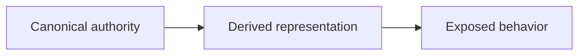

# Repository Anti-Drift Audit Report Presentation Guidance

Use this reference to present a full Markdown audit result in the normal response.

[`../SKILL.md`](../SKILL.md) is the canonical executable contract. It governs invocation, path validation, audit responsibility, finding classes, provenance, coverage, safety, and closure semantics. This reference controls presentation only.

The audit result is an observation of repository state at audit time. It does not become repository authority or a canonical semantic owner.

Use this title:

```text
# Repository Anti-Drift Audit Report
```

## Summary

Give a compact orientation:

- target repository or scoped surface;
- AUDIT capability;
- audit time when available;
- counts by finding class;
- one short evidence-backed conclusion.

## Audit configuration

Show applicable inputs and canonical provenance/coverage labels from `SKILL.md`:

```text
Canonical owners:
  <provenance labels and paths>

Comparison targets:
  <provenance labels and paths>

Search boundary:
  <scope or repository root>

Coverage:
  <TARGETED or SYSTEMATIC_SEARCH_WITHIN_SCOPE>
```

For targeted coverage, state that unsearched surfaces were not evaluated and are not claimed drift-free.

## Finding classes

Use the canonical classes without changing their meaning:

- `CURRENT_DRIFT` — evidence establishes a current violated invariant or contradiction.
- `POLICY_ONLY` — policy exists without demonstrated deterministic enforcement.
- `COMPATIBILITY_RISK` — authority or intent is unresolved and a wrong interpretation could violate compatibility.
- `ALREADY_ENFORCED` — existing deterministic evidence supports enforcement for the stated denominator.

## Material findings

Use only applicable fields; do not force empty sections:

```markdown
### <FINDING CLASS> — <short title>

**FINDING**
<what was observed or assessed>

**EVIDENCE**
<paths, symbols, commands, contracts, and direct observations>

**ROOT_CAUSE**
<present cause/authority explanation or unresolved candidates>

**SEMANTIC_OWNER**
<canonical owner or candidate owners with provenance>

**VIOLATED_INVARIANT**
<condition not currently satisfied>

**AFFECTED_SURFACES / DENOMINATOR**
<relevant consumers, copies, boundaries, and coverage population>

**GUARD_COVERAGE**
<current enforcement, responsiveness evidence, and limits>

**COMPATIBILITY_RISK**
<behavior, interface, persisted-data, generated-artifact, external-contract, or WIP risk>

**UNRESOLVED_INTENT**
<what cannot safely be inferred; use DO NOT GUESS where applicable>

**CLOSURE_CONDITIONS**
<what must become true for this finding to close>

**LIMITATIONS**
<unsearched, unmeasured, unavailable, or inconclusive evidence>
```

`CLOSURE_CONDITIONS` states required end conditions. It must not select a change technique, target file set, mutation scope, work sequence, commit operation, or authority grant.

## Existing enforcement and proof

List relevant observed tests, guards, check-only generators, fixed-point checks, CI gates, runtime validation, characterization, counterexamples, and externally produced falsification evidence. Distinguish responsiveness to one falsifier from structural or failure-class closure. Never claim proof that was not observed.

## Audit non-mutation check

State exactly what Git-visible state was captured before and after the audit, what was compared, and the result. Distinguish status/path comparison from stronger diff or content-hash evidence. Identify ignored, external, or otherwise unmeasured surfaces as limitations.

The audit result must contain audit facts and closure conditions only. It must not contain instructions to perform corrective work or grant repository/Git authority.

## Mermaid guidance

Use Mermaid only when it materially clarifies an authority, dependency, or evidence relationship. Keep nodes short and put detailed explanation in prose.

Example:



Do not use a diagram to imply that graph order alone establishes causality or defect location.
