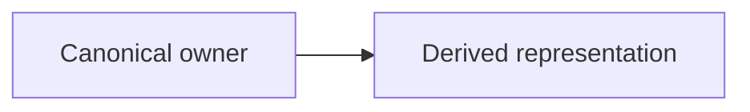
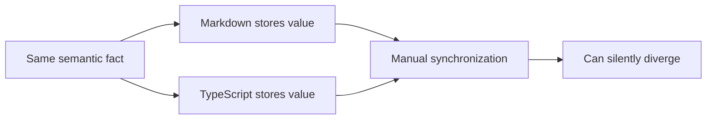

# Repository Anti-Drift Audit Report Presentation Guidance

Use this reference only to present an optional full Markdown report requested with `report=<path>`.

`SKILL.md` is the canonical execution contract. It defines when a report may be written, path validation, authorization, audit behavior, finding classes, provenance labels, coverage labels, and non-mutation requirements. This reference does not redefine those rules.

The report presents an observation of repository state at audit time. It does not become repository authority or a canonical semantic owner. See `SKILL.md` for the authoritative execution and ownership contract.

Use this title for the generated report:

```text
# Repository Anti-Drift Audit Report
```

## Summary

Give a developer who is new to Repository Anti-Drift a compact orientation:

- target repository or scoped surface;
- operating mode;
- audit time when available;
- counts by finding class;
- one short conclusion.

## Audit configuration

Show the configuration required by `SKILL.md`, using the applicable provenance and coverage labels:

```text
Canonical owners:
  <provenance labels and paths>

Comparison targets:
  <provenance labels and paths>

Search boundary:
  <scope or repository root>

Coverage:
  <TARGETED or SYSTEMATIC_SEARCH_WITHIN_SCOPE>

Mode:
  audit — read-only
```

## What the finding classes mean

Use the canonical finding classes from `SKILL.md`. Explain them briefly and plainly without changing their meaning:

- **`CURRENT_DRIFT`** — repository evidence shows that representations currently disagree.
- **`POLICY_ONLY`** — a rule exists in documentation, comments, agent instructions, or similar policy, but no test, guard, CI check, or equivalent deterministic enforcement prevents a violation from remaining green.
- **`COMPATIBILITY_RISK`** — evidence is insufficient or intent is unresolved, so changing the surface could conflict with existing or in-progress repository design.
- **`ALREADY_ENFORCED`** — an existing deterministic mechanism detects the prohibited divergence.

## Highest-risk findings

Use this beginner-friendly structure for each major finding:

```markdown
### CURRENT_DRIFT — <short title>

**In one sentence**
<plain-language explanation>

**FACT**
<observed repository evidence>

**INTERPRETATION**
<what the evidence means and what remains inference>

**Why this matters**
<practical consequence>

**Current flow**
<optional Mermaid diagram when it materially clarifies the relationship>

**NEXT**
<smallest structural remediation>

**Evidence**
<relevant paths, symbols, commands, or proofs>
```

## Additional governance findings

Use the same structure, shortened when the evidence is straightforward.

## Existing enforcement and proofs

List relevant existing tests, guards, generators, fixed-point checks, CI gates, runtime validation, and observed proof results. Do not claim proof that was not actually observed.

## Audit non-mutation check

State exactly what repository state was mechanically captured before and after the audit, what was compared, and the result. Distinguish status/path comparison from stronger diff or content-hash comparison. Do not claim that repository contents were mechanically unchanged when the evidence covered only status labels.

## Limits

State material limits, including:

- surfaces not searched;
- unavailable generators or contracts;
- uncommitted work present during the audit;
- checks that could not run;
- anything not mechanically proven.

## Mermaid guidance

Use Mermaid only when it clarifies a semantic relationship. Prefer compact horizontal diagrams:



Use normal boxes by default. Use a decision diamond only for a short, genuine yes/no decision where it materially improves comprehension. Do not put long English or Japanese sentences inside diamonds.

Keep nodes short. Use `<br/>` only when it improves readability. Put detailed explanation in prose below the diagram instead of paragraphs inside nodes. Show one conceptual problem per diagram and avoid tall layouts unless the relationship requires one.

Example duplicate-owner diagram:


